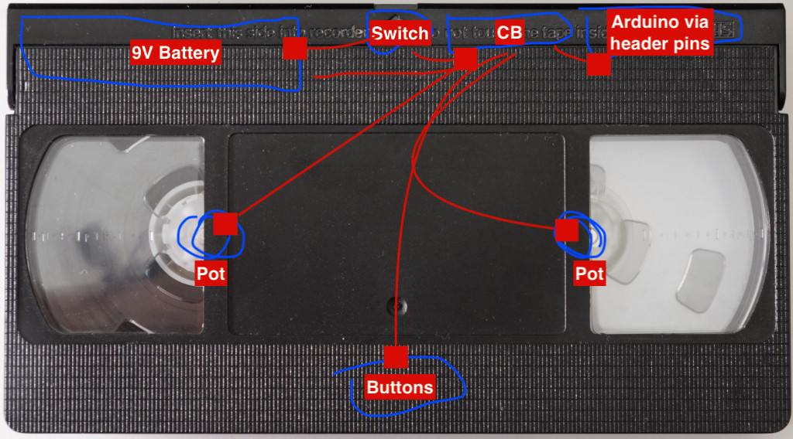

# VS-011
This VS is a digital tape delay, created using the Arduino nano. Due to memory limitations, only a limited delay length is possible (1900 ms), although you could optimize this.

The code and circuit are taken from [https://projecthub.arduino.cc/CesarSound/c4f2fdea-9035-44a8-9e2c-60ea6ff38159](CesarSound) and tweaked to taste. 

### Features
- Dry/wet knob
- set delay length (0 - 1900ms). The longer the delay, the more distorted the signal becomes
- Play audio signal reversed
- Overdub feature 

To make the VS-011, apart from the files in this repo, you'll need
- a videotape, preferably from your year of birth
- pin headers
- 2 audio jacks
- Arduino nano
- Material suitable to be laser-cut, <3mm thick
- 9V battery + battery clip
- 2 potentiometers
- 1 switch
- XXXX Resistors
- XXXX Capacitors
- XXXX 
- 2 button switches
- Apple magic keyboard

# Build instructions
Prepare the videotape to meet the following. For more info on VHS, see https://goughlui.com/the-vhs-corner/intro-inside-the-vhs-cassette-vcr/
- remove all screws (keep 'em) so all parts of the tape are accessible
- Remove and keep all the little loose parts and things 
- remove the so-called "top flap". You'll create a new one later.
- remove the transparent circular things from the white reels, try not to break the reels.
- Drill holes in the white reels, so a potentiometer will fit. This is a bit tricky and make sure not to saw in your hand doing so.
- Remove the aluminum strap from the front panel. Now, you can drill holes for the potentiometers.
- cut two holes for the buttons in the front panel. On the back panel, cut away some material so the buttons will fit on the inside as well.
- Cut away as much of the material on the top side, behind the removed top flap, as possible. This will house the electronics
- Cut away material on the left and right side, behind the removed top flap. Use `panel/VS-014_Side.dxf` as a guide, cut away material so the audio jack (bigger hole) will fit, and drill a hole for the bolt. The bolts will keep the new top flap connected to the tape.

Now, your tape is stripped and ready for the new top flap

## Creating the top flap
Lasercut 1x front, 1x top, and 2x side (one is mirrored). If you need to alter dimensions, the fusion files are also included in the `panel` folder. Glue the front to the 2x sides using wood glue, but keep the top apart.

## Circuit
Prepare the schematic below using a Perfboard. Keep in mind the dimensions of the tape, everything still has to fit inside. See the image below of what goes where.

Glue the created circuit board to the inside of the front panel. Connect the Arduino to the front panel using the header pins. Attach the switch, battery clip, and audio jacks, and connect everything according to the schematic.

Happy and tested? Now connect the top panel to the new flap, and put the 2 bolts in place. Time to play!

### Resources

